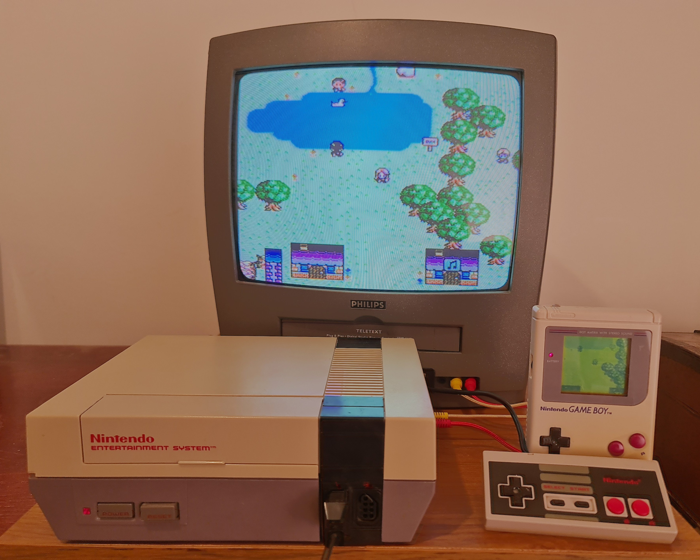

# BB Studio Drag-n-Drop Game Creator for NES/Famicom

## What is this?

"BB Studio" is a heavily-hacked version of the awesome GB Studio by Chris Maltby. 

The original GB Studio can be found [HERE](https://www.gbstudio.dev) for friendly donwloadables and [HERE](https://github.com/chrismaltby/gb-studio) for the source code on github.

It replaces the Game Boy target with the NES (the Game Boy's "Big Brother").

You are strongly advised to already be familiar with the original GB Studio, before trying out BB Studio.

## End User License Agreement

The current version is early-alpha software with all the bugs and warts that entails.

It is targeted at early adopters who like to tinker with experimental software.

It may crash-and-burn on you - and you shall remain patient and courteous.

Other than that, the MIT license [MIT license](https://opensource.org/licenses/MIT) applies.

## How to use it

There are a few key things to consider to make your GBC game run well on the NES.

* You have more screen space: 256x240 instead of 160x144. This can change the look and feel of your GBC game quite a bit, for better or worse.

* The edges of the screen will be partially cropped on a real TV - this varies depending on TV model.

* You can only use half the number of background and sprite palettes in a scene. (for now)

* NES background palettes also require the first color to be the same across all 4 background palettes.
- Typically black is a good choice for the shared background color - but your mileage may vary.
- The exception is palette 7. This is only used for UI, and has 4 unique colors.

* The NES has a limited number of total colors, and the RGB colors entered in the UI will be automatically converted to NES colors when building. They may sometimes be off from what you intended.
- The next version will have an option for specifying NES colors directly, to remove the guesswork of RGB -> NES color mapping.

* The NES graphics chip allows much fewer sprites / scanline than the GB/GBC. So you need to be much more frugal with placing sprites on the same horizontal line.

* The 6502 CPU may struggle to keep up with the double-clocked GBC CPU. If your game already tends to lag when running in monochrome DMG mode, it will probably struggle on the NES as well.
- More optimizations are planned for the next version.

### Using music in your project

BB Studio uses the FamiStudio sound engine, so any songs in your game need to be re-created with FamiStudio.

A future version may support auto-converting Game Boy songs to FamiStudio format. But re-making your song in FamiStudio will always be the recommended option for best results.

To make a FamiStudio .fms file replace a GB Studio file, simply put it into the assets/music directory of your project, with an identical name as the .uge file apart from the .uge extension being replaced with .fms instead.
The build process will then pick up your FamiStudio song in place of the .uge one.

FamiStudio also requires you to set the tempo mode to either "FamiStudio tempo" or "FamiTracker tempo". This is a global driver setting decided at build time.

The current setting is FamiTracker tempo, as all music files were originally in tracker format.

If you wish to use FamiStudio tempo instead, you can edits this file manually:

`appData/src/gb/src/core/asm/nes/demo_sdcc.asminc.s`

And change the line `FAMISTUDIO_USE_FAMITRACKER_TEMPO = 1` to `FAMISTUDIO_USE_FAMITRACKER_TEMPO = 0`.

Don't try to change any other settings unless you really know what you're doing. The FamiStudio driver will likely crash your game if you disable an effect the music relies on.

#### Sound effects

SFX is not supported in this alpha version, but will be added soon.

## Running your built NES game

Your NES game can be run on an Everdrive N8 Pro, by placing your built .nes file in a subdirectory on the sdcard along with the provided bbstudio.rbf. This contains an Everdrive N8 Pro implementation of the custom mapper BB Studio requires.

For running on a PC you can instead use a customized version of the Mesen emulator [downloadable here](https://github.com/michel-iwaniec/Mesen2/releases/tag/Mesen2-with-bbstudio-mapper).

## Putting your NES game on a stand-alone cartridge for sale

BB Studio uses a custom NES mapper to enable some GBC-like features such as 8x8 color attributes in an affordable way. 

Because the mapper is not 100% finished yet, .nes files built by BB Studio currently use a temporary mapper number of 248, to indicate the mapper is defined by the Everdrive N8 Pro .RBF file.

Sharing those files is not really recommended, as they may not work with the final version of the mapper.

Prototypes of the mapper have already been built and tested. One vintage-like discrete board using only simple TTL chips. 

And a more optimized board with all logic squeezed into a 32-macrocell CPLD.

The specifications for this mapper should be finalized by the end of 2024, with boards being available in 2025.

## Something isn't working! How do I report it?

Please use the issue tracker on this github page... but only if the bug is specific to BB Studio rather than GB Studio :)
